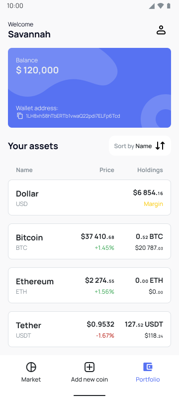
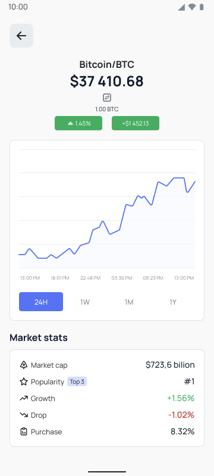

# yet-another-flutter-crypto-tracker

## Overview

YAFCT - Yet Another Flutter Crypto Tracker - a simple Flutter application that tracks cryptocurrency
prices using the CoinGecko API. It displays a list of cryptocurrencies with their current prices,
market capitalization, and 24-hour price
changes.

## Features

- Fetches real-time cryptocurrency data from the CoinGecko API.
- Displays a list of cryptocurrencies with relevant information.
- Pull-to-refresh functionality to update the data.


|  |  |
|--------------------------------|---------------------------------|

## Troubleshooting

Encountering issues while using YAFCT? Check out the troubleshooting section for common problems
and solutions. If you still need assistance, feel free to reach out to the YAFCT community
for support.

## Contributing

I welcome contributions from the community to help improve YAFCT. Whether you want to report a
bug,
suggest a new feature, or submit a pull request, follow the contribution guidelines outlined in the
project's repository. Together, we can make YAFCT even better.


## License
MIT License

```
Copyright (c) [2025] [Andrew Malitchuk]

Permission is hereby granted, free of charge, to any person obtaining a copy  
of this software and associated documentation files (the "Software"), to deal  
in the Software without restriction, including without limitation the rights  
to use, copy, modify, merge, publish, distribute, sublicense, and/or sell  
copies of the Software, and to permit persons to whom the Software is  
furnished to do so, subject to the following conditions:

The above copyright notice and this permission notice shall be included in all  
copies or substantial portions of the Software.

THE SOFTWARE IS PROVIDED "AS IS", WITHOUT WARRANTY OF ANY KIND, EXPRESS OR  
IMPLIED, INCLUDING BUT NOT LIMITED TO THE WARRANTIES OF MERCHANTABILITY,  
FITNESS FOR A PARTICULAR PURPOSE AND NONINFRINGEMENT. IN NO EVENT SHALL THE  
AUTHORS OR COPYRIGHT HOLDERS BE LIABLE FOR ANY CLAIM, DAMAGES OR OTHER  
LIABILITY, WHETHER IN AN ACTION OF CONTRACT, TORT OR OTHERWISE, ARISING FROM,  
OUT OF OR IN CONNECTION WITH THE SOFTWARE OR THE USE OR OTHER DEALINGS IN THE  
SOFTWARE.  
```